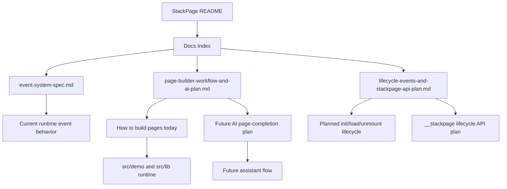
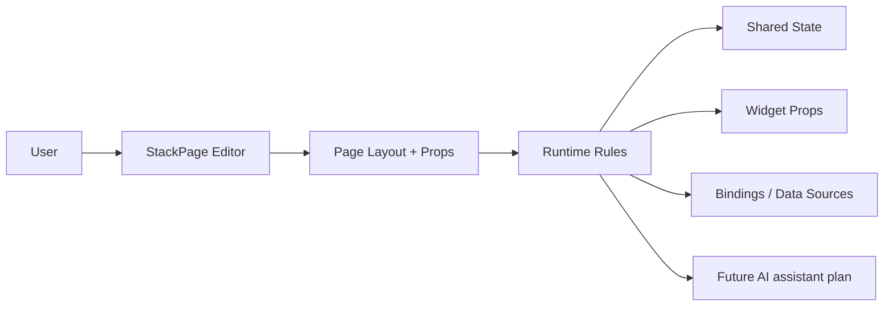

# StackPage Docs Index

This is the first vision / entry point for understanding StackPage page building.

> Status: active library + active docs plan
>
> Start here:
> 1. `event-system-spec.md`
> 2. `page-builder-workflow-and-ai-plan.md`
> 3. `lifecycle-events-and-stackpage-api-plan.md`
> 4. `../README.md`

## Quick map

If you are returning after a session interruption, read these docs in order:

1. [`event-system-spec.md`](./event-system-spec.md)
2. [`page-builder-workflow-and-ai-plan.md`](./page-builder-workflow-and-ai-plan.md)
3. [`lifecycle-events-and-stackpage-api-plan.md`](./lifecycle-events-and-stackpage-api-plan.md)

---

## What StackPage is

StackPage is a React + TypeScript page builder library built on `gridstack.js`.

It focuses on:

- drag-and-drop page composition
- schema-driven property editing
- data binding
- page-level interaction rules
- shared page state
- runtime widget communication
- future AI-assisted page completion

### Visual model

---

## How the docs fit together

### 1) Event system spec

Use this when you want to understand the current runtime behavior:

- how events are emitted
- how interaction rules are executed
- what the runtime handler does today
- what is not implemented yet

Read:

- [`event-system-spec.md`](./event-system-spec.md)

### 2) Page-builder workflow and AI plan

Use this when you want to understand how to build pages today and how the future AI assistant should help.

Read:

- [`page-builder-workflow-and-ai-plan.md`](./page-builder-workflow-and-ai-plan.md)

### 3) Lifecycle events and `__stackpage` API plan

Use this when you want to understand the planned page/widget init and load lifecycle flow.

Read:

- [`lifecycle-events-and-stackpage-api-plan.md`](./lifecycle-events-and-stackpage-api-plan.md)

---

## Recommended reading order

If you are new to the project, read in this order:

1. `event-system-spec.md`
2. `page-builder-workflow-and-ai-plan.md`
3. `lifecycle-events-and-stackpage-api-plan.md`
4. `../README.md`

If you are debugging a specific issue, use this shortcut:

- **event behavior issue** → `event-system-spec.md`
- **page build / AI flow question** → `page-builder-workflow-and-ai-plan.md`
- **init / load / mount / cleanup question** → `lifecycle-events-and-stackpage-api-plan.md`

---

## Current project vision

The short version:

- pages are built manually today
- event rules are declarative and runtime-driven
- AI-assisted page completion is planned, not implemented
- lifecycle events are planned as the next step to reduce hardcoded component init logic

That is the current page-build vision.

---

## Recovery tip

If you only remember one thing after reopening the project:

> Read `event-system-spec.md`, then `page-builder-workflow-and-ai-plan.md`, then `lifecycle-events-and-stackpage-api-plan.md`.

---

## Source locations

Important code paths:

- `src/lib/components/stackpage.tsx`
- `src/lib/components/StackPageProvider.tsx`
- `src/lib/utils/componentCommunication.ts`
- `src/lib/gridstack/grid-stack-widget-render.tsx`
- `src/lib/components/PropertiesTab.tsx`
- `src/lib/components/DataTab.tsx`
- `src/demo/components/MyComponents.tsx`
