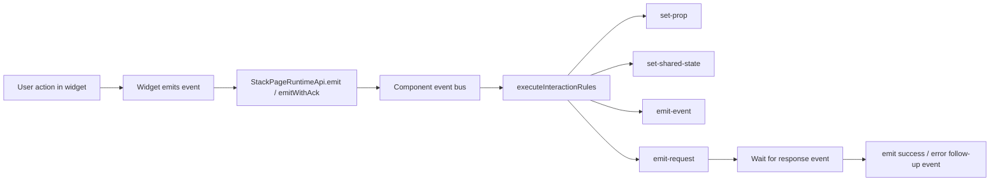
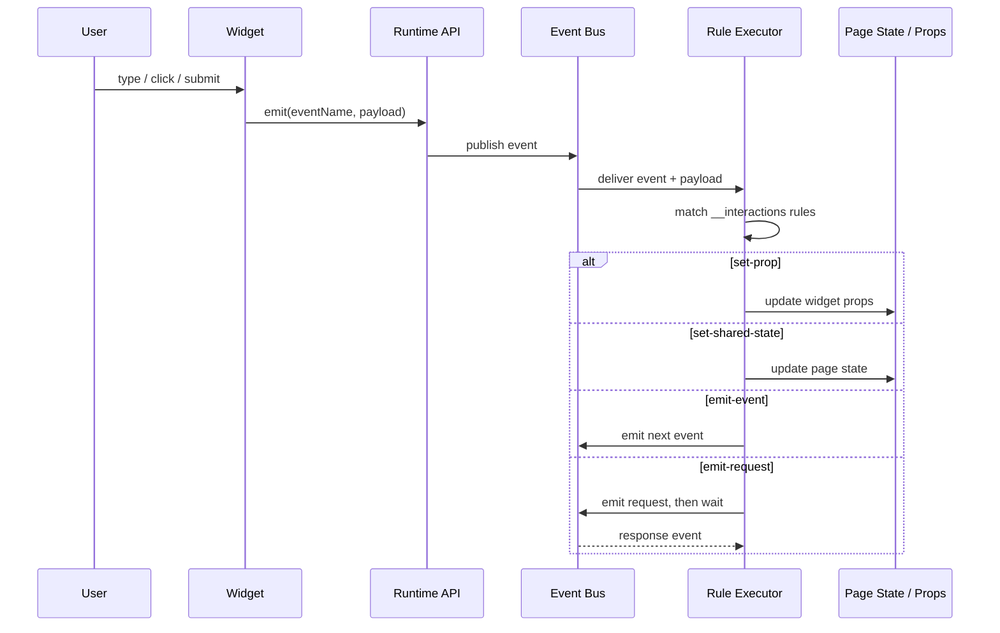

# StackPage Event System Specification

## Purpose

This document explains how events work in StackPage today:

- how a component emits an event
- how the runtime matches that event to interaction rules
- what the built-in “handler” does
- what is not implemented yet
- what remains a future page-builder / AI task

This spec is written for session handoff, so a new conversation can recover the event model quickly.

---

## 1. Core concepts

### 1.1 Event

An event is a named runtime signal such as:

- `click`
- `search`
- `submit`
- `demo:registration:submit`
- `contact:submit:request`

Events are emitted by a widget or by the page runtime.

### 1.2 Interaction rule

An interaction rule is declarative configuration stored in component props under `__interactions`.

It says:

- when `event = X`
- do action `Y`
- optionally read a value from the event payload
- optionally target another component or shared page state

### 1.3 Runtime handler

The current runtime handler is the rule executor.

It does **not** mean AI-generated custom code.

It means:

- match the emitted event
- resolve a value from the payload
- apply the configured action

### 1.4 Shared page state

Shared page state is page-level state stored in `StackPageProvider` and exposed through:

- `__stackpage.setPageState(...)`
- `__stackpage.getPageState(...)`

It is used when multiple widgets need the same state.

---

## 2. Current data model

### 2.1 Rule shape

Current interaction rules use this shape:

```ts
interface InteractionRule {
  id?: string;
  description?: string;
  event: string;
  action: "set-prop" | "set-shared-state" | "emit-event" | "emit-request";
  targetWidgetId?: string;
  targetPath?: string;
  responseEvent?: string;
  timeoutMs?: number;
  onSuccessEvent?: string;
  onErrorEvent?: string;
  value?: any;
  valueFrom?: string;
  enabled?: boolean;
}
```

### 2.2 Where rules live

Rules are usually saved in:

- component props: `__interactions`

Other related metadata often lives alongside them:

- `__schema`
- `__bindings`
- `__ignoredMappings`

### 2.3 Runtime API

Widgets receive `__stackpage`, which includes methods such as:

- `emit(eventName, payload?)`
- `emitWithAck(eventName, payload?, options?)`
- `subscribe(eventName, handler)`
- `setPageState(path, value)`
- `getPageState(path, defaultValue?)`

---

## 3. Event lifecycle

### 3.1 Current flow

1. A widget emits an event
2. `GridStackWidgetRenderer` forwards it through the runtime API
3. `createStackPageRuntimeApi(...)` sends the event into the page event bus
4. `executeInteractionRules(...)` checks rules for a matching `event`
5. The matching rule action runs
6. That action can:
   - update a widget prop
   - update shared page state
   - emit another event
   - send a request and wait for a response

### 3.2 What the handler does today

Today the handler is the built-in action executor:

- `set-prop` writes into another widget’s props
- `set-shared-state` writes into page state
- `emit-event` emits a follow-up event
- `emit-request` emits a request and then emits success/error follow-up events

### 3.3 What the handler does not do today

The handler does **not**:

- invent AI-generated logic
- create a new custom function automatically
- build a new component handler from scratch
- replace the declarative rule system

That is a separate future task.

---

## 4. Action semantics

### 4.1 `set-prop`

Writes a resolved value into a widget prop.

Typical use:

- click a card, update the detail widget
- submit a form, update a status widget

### 4.2 `set-shared-state`

Writes a resolved value into shared page state.

Typical use:

- search input updates `keyword`
- selection widget updates `selectedId`

### 4.3 `emit-event`

Emits another event after the current event is handled.

Typical use:

- fan-out or chain events
- trigger a follow-up step

### 4.4 `emit-request`

Emits a request event and waits for a response event.

Typical use:

- sender/receiver bridge
- request/ack flows

Success and error follow-up events are emitted after the response or timeout outcome.

---

## 5. Diagram

### 5.1 Event flow diagram



### 5.2 Sequence diagram



---

## 6. Current implementation locations

### Runtime and execution

- `packages/stackpage/src/lib/utils/componentCommunication.ts`
  - `executeInteractionRules(...)`
  - `createStackPageRuntimeApi(...)`
  - event bus helpers

- `packages/stackpage/src/lib/gridstack/grid-stack-widget-render.tsx`
  - injects `__stackpage`
  - emits widget events in edit/view/preview runtime

- `packages/stackpage/src/lib/components/StackPageProvider.tsx`
  - holds shared page state
  - stores widget snapshots and props
  - owns the runtime event bus

### UI authoring

- `packages/stackpage/src/lib/components/InteractionEditorDialog.tsx`
  - author interaction rules
  - store them in `__interactions`

- `packages/stackpage/src/lib/components/PropertiesTab.tsx`
  - surfaces event summary and action entry points

- `packages/stackpage/src/lib/components/JsonTab.tsx`
  - shows raw JSON and defined event info

---

## 7. What is still a future task

The following is **not** implemented yet:

- AI auto-generation of handlers from a user-defined event
- automatic creation of component-specific handler code
- a separate “handler compiler” for page builder events

If you want StackPage to do that later, the future task is to generate:

1. a rule template or handler plan from the UI
2. a persisted event rule or handler block
3. runtime execution through the existing event system

For now, the rule executor is the handler.

---

## 8. Practical example

If a search input emits:

```ts
emit("search", { keyword: "page" })
```

and the page has a rule:

```json
{
  "event": "search",
  "action": "set-shared-state",
  "targetPath": "demo.search.keyword",
  "valueFrom": "$.keyword",
  "enabled": true
}
```

then the runtime will write:

```ts
demo.search.keyword = "page"
```

That is the current meaning of “handler” in StackPage.

