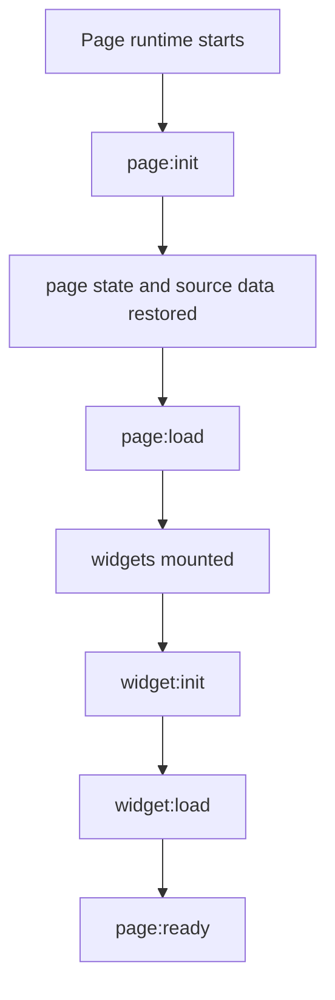
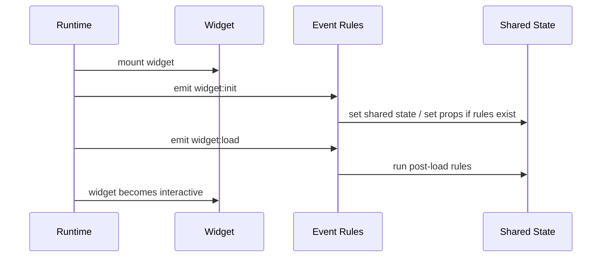

# StackPage Lifecycle Events and `__stackpage` API Plan

## Purpose

This document plans the next StackPage event layer:

- lifecycle events such as `init` and `load`
- how they should be exposed through the `__stackpage` runtime API
- how they should work with the existing declarative interaction rules
- what should move out of hardcoded component logic
- what remains intentionally out of scope

This is a planning document, not an implemented feature spec.

---

## 1. Problem statement

Today, some widget initialization behavior is still written directly in components.

That works, but it creates problems:

- behavior is hidden inside React component logic
- page builder users cannot see or edit the behavior easily
- init/load logic is mixed with render logic
- future AI-assisted page completion cannot reason about the behavior cleanly

The goal is to move page-level and widget-level lifecycle behavior into the same runtime rule system that already handles interaction rules.

---

## 2. Design goal

Lifecycle behavior should be expressed as:

- runtime events
- declarative rules
- `__stackpage` API calls

not as hardcoded component logic where possible.

The component should still own truly local UI details, but page-level initialization should be configurable.

---

## 3. Proposed lifecycle event model

### 3.1 Event names

Recommended lifecycle events:

- `page:init`
- `page:load`
- `page:ready`
- `widget:init`
- `widget:load`
- `widget:unmount`

Optional later events:

- `page:save`
- `page:reset`
- `widget:focus`
- `widget:blur`

### 3.2 Intent of each event

- **`page:init`**
  - fires when the page runtime is created
  - best for one-time page bootstrap

- **`page:load`**
  - fires after page state and source data are restored
  - best for hydration logic

- **`page:ready`**
  - fires after the page is ready for interaction
  - best for post-load setup

- **`widget:init`**
  - fires when a widget runtime is created
  - best for component bootstrap or local defaults

- **`widget:load`**
  - fires after widget props / bindings are available
  - best for derived display initialization

- **`widget:unmount`**
  - fires when a widget is removed or the page unloads
  - best for cleanup / unsubscribe / timer teardown

---

## 4. Relationship to `__stackpage`

Lifecycle events should be surfaced through the same runtime API that widgets already use.

### Existing API surface

`__stackpage` already provides:

- `emit(...)`
- `emitWithAck(...)`
- `subscribe(...)`
- `unsubscribe(...)`
- `setState(...)`
- `getState(...)`
- `setPageState(...)`
- `getPageState(...)`

### Planned extension

Lifecycle events should be emitted by the runtime, not handcrafted by each component.

That means the runtime can do something like:

- emit `widget:init`
- emit `widget:load`
- emit `page:load`

Then declarative rules can respond to those events in the same system used for user interactions.

---

## 5. Proposed flow

### 5.1 Page flow



### 5.2 Widget lifecycle flow



---

## 6. Sync vs async behavior

Lifecycle events should **not** force every action to be async.

Recommended model:

- keep simple rules synchronous where possible
- allow async-capable actions when needed
- use the same rule executor for both

### Sync-friendly actions

- `set-prop`
- `set-shared-state`

### Async-capable actions

- `emit-request`
- future data fetch actions
- future AI actions

### Rule

Lifecycle events should be able to trigger async work, but the runtime itself should remain deterministic.

---

## 7. What should move out of hardcoded component logic

Candidate behaviors to migrate into lifecycle rules:

- initial page-state bootstrap
- widget derived state initialization
- page-level default hydration
- “on load” display setup
- subscription registration
- cleanup teardown

Candidate behaviors to keep in component code:

- pure visual rendering
- local input styling
- UI-only temporary state that is not part of page behavior

---

## 8. Example of planned declarative lifecycle rules

Example idea:

```json
{
  "event": "widget:load",
  "action": "set-shared-state",
  "targetPath": "demo.search.keyword",
  "valueFrom": "$.initialKeyword",
  "enabled": true
}
```

This would let a widget populate shared page state during load without hardcoding that logic in the component body.

---

## 9. AI assistant relationship

Once lifecycle events exist, the AI assistant can reason about page bootstrapping more clearly:

- detect missing initialization rules
- suggest `page:load` or `widget:load` rules
- suggest shared-state bootstrap
- suggest event cleanup hooks

This would make the future AI page-completion flow more declarative and easier to review.

---

## 10. Non-goals

This plan does **not** currently include:

- replacing the existing event system
- making all actions async
- hiding lifecycle events from the user
- auto-generating component code
- auto-publishing changes

---

## 11. Recommended implementation stages

### Stage 1: API extension plan

- define lifecycle event names
- decide where the runtime should emit them
- decide which widgets should subscribe to them

### Stage 2: runtime hook support

- add lifecycle emission in the runtime
- connect lifecycle emission to `__stackpage`

### Stage 3: rule authoring support

- add lifecycle event choices in the UI
- let users author `init` / `load` rules

### Stage 4: component migration

- move page-level bootstrap out of hardcoded components
- keep only local UI behavior in the component

---

## 12. Current status

This document is still the **forward contract**, but part of the plan is now implemented:

- `widget:init`
- `widget:load`
- `widget:unmount`
- `page:init`
- `page:load`
- `page:ready`
- scope-aware `once` execution for lifecycle interaction rules

The remaining work is primarily UI authoring support and any further migration of hardcoded init logic out of component bodies.

---

## 13. Exact lifecycle rule schema

The lifecycle system should reuse the same declarative rule shape that StackPage already uses for `__interactions`.

### 13.1 Core rule shape

```ts
type LifecycleEventName =
  | "page:init"
  | "page:load"
  | "page:ready"
  | "widget:init"
  | "widget:load"
  | "widget:unmount";

interface LifecycleInteractionRule {
  id?: string;
  description?: string;
  event: LifecycleEventName;
  action: "set-prop" | "set-shared-state" | "emit-event" | "emit-request";
  targetWidgetId?: string;
  targetPath?: string;
  responseEvent?: string;
  timeoutMs?: number;
  onSuccessEvent?: string;
  onErrorEvent?: string;
  value?: any;
  valueFrom?: string;
  enabled?: boolean;
  once?: boolean;
}
```

### 13.2 Schema rules

- `event` must be one of the lifecycle event names
- `action` uses the same runtime action set as current interaction rules
- `targetWidgetId` is still used for `set-prop`
- `targetPath` is still used for `set-prop`, `set-shared-state`, `emit-event`, and `emit-request`
- `once` marks rules that should only run once per page or widget lifecycle

### 13.3 Why `once` is needed

Lifecycle rules often represent bootstrap behavior.

Examples:

- initialize shared page state only once
- set default widget state only once after load
- run cleanup only once on unmount

### 13.4 Example lifecycle rules

#### Page bootstrap

```json
{
  "id": "page-init-state",
  "event": "page:init",
  "action": "set-shared-state",
  "targetPath": "demo.search.keyword",
  "value": "page",
  "enabled": true,
  "once": true
}
```

#### Widget load hydration

```json
{
  "id": "widget-load-title",
  "event": "widget:load",
  "action": "set-prop",
  "targetWidgetId": "$self",
  "targetPath": "title",
  "valueFrom": "$.initialTitle",
  "enabled": true
}
```

#### Unmount cleanup

```json
{
  "id": "widget-unmount-teardown",
  "event": "widget:unmount",
  "action": "emit-event",
  "targetPath": "widget:cleanup",
  "enabled": true,
  "once": true
}
```

### 13.5 Compatibility note

This plan intentionally keeps the lifecycle rule shape aligned with the existing `InteractionRule` model so the UI, runtime executor, and future AI planner can reuse the same authoring and validation pipeline.

---

## 14. Implementation checklist

Use this checklist for the first lifecycle-event implementation slice.

### 14.1 Runtime emission points

- [x] emit `page:init` when the page runtime is created
- [x] emit `page:load` after layout, page state, and source data are restored
- [x] emit `page:ready` after the page is interactive
- [x] emit `widget:init` when a widget runtime is created
- [x] emit `widget:load` after widget props and bindings are available
- [x] emit `widget:unmount` when a widget is removed or the page unloads

### 14.2 Rule execution support

- [x] allow lifecycle events to use the existing rule executor
- [x] support the `once` flag for bootstrap and cleanup rules
- [x] keep `set-prop`, `set-shared-state`, `emit-event`, and `emit-request` unchanged
- [x] keep async support only where the action requires it

### 14.3 UI authoring support

- [ ] add lifecycle event choices to the interaction editor
- [ ] surface lifecycle rules in the properties panel
- [ ] explain the difference between page-level and widget-level lifecycle rules

### 14.4 Migration from hardcoded component logic

- [ ] move page bootstrap out of hardcoded component bodies where possible
- [ ] move widget hydration out of component bodies where possible
- [ ] keep only local visual behavior inside the component
- [ ] document any remaining hardcoded init logic as intentional

### 14.5 AI assistant follow-up

- [ ] let the future AI assistant suggest lifecycle rules
- [ ] have the assistant explain why a lifecycle rule is needed
- [ ] require user review before applying lifecycle rules to a draft page
