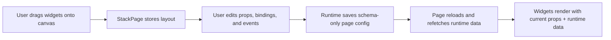
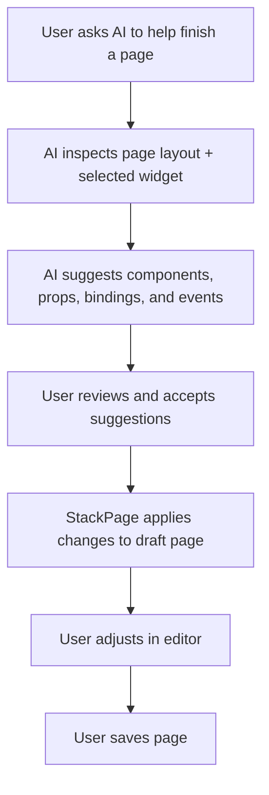

# StackPage Page Builder Workflow and AI Assistant Plan

## Purpose

This document explains:

1. how to build a page with StackPage today
2. how the current page builder pieces fit together
3. what the future AI assistant flow should do
4. what is **not implemented yet**

This is a planning and recovery document. It is intentionally explicit so the workflow can be restored after a session interruption.

---

## 1. How to build a page today

### Step 1: define your components

Create React components for the widgets you want to place on the page.

Each component should accept the props you expect to edit in the builder.

Example:

```tsx
const Hero = ({ title, description }) => (
  <section>
    <h1>{title}</h1>
    <p>{description}</p>
  </section>
);
```

### Step 2: provide the component map

Register the components with `componentMapProvider`.

This tells StackPage what widgets are available at runtime.

### Step 3: provide the component catalog

Register which components appear in which groups:

- `common`
- business-specific groups

This controls what the user sees in the component picker.

### Step 4: provide default props

Use `componentPropsProvider` to seed each widget with initial props.

This is what the property editor starts from.

### Step 5: add the page to the editor/runtime

Render `<StackPage />` with:

- `pageid`
- `pageMode`
- `onLoadLayout`
- `onSaveLayout`
- `componentMapProvider`
- `componentCatalogProvider`
- `componentPropsProvider`
- `getHostDataSources` when needed

### Step 6: place widgets on the canvas

Drag widgets from the component panel into the layout.

Use the page editor to:

- move widgets
- resize widgets
- nest widgets
- clear or reset layout areas

### Step 7: configure properties

Open the properties panel and edit:

- form fields
- schema
- JSON
- bindings
- interaction rules

### Step 8: bind data

Attach data sources to the widget using the binding UI.

This allows runtime data to feed the page and keeps the saved page schema-only.

### Step 9: define events

Create interaction rules for widget behavior:

- emit a follow-up event
- write to shared page state
- update another widget prop
- perform request/response flows

### Step 10: save the page

Saving stores the page configuration, not runtime-fetched data.

Saved page state includes:

- layout
- page attributes
- page state
- source configuration
- widget metadata

---

## 2. Current page-builder runtime model

The page builder currently works as a declarative runtime, not an AI-generated page compiler.

### Current flow



### Current runtime pieces

- `StackPageProvider`
- `GridStackRender`
- `GridStackWidgetRenderer`
- `componentCommunication.ts`
- `PropertiesTab`
- `DataTab`
- `InteractionEditorDialog`

---

## 3. Future AI assistant flow

The AI assistant flow is the next-stage plan.

It is **not implemented yet** in StackPage.

### Goal

Let the assistant help the user complete a page by:

- understanding the current page context
- suggesting components
- suggesting props / schema values
- suggesting data bindings
- suggesting interaction rules
- producing a page draft the user can review before save

### Future AI-assisted flow



### Expected assistant responsibilities

The assistant should eventually be able to:

- summarize the current page state
- propose missing sections
- propose props for existing widgets
- propose data source bindings
- propose interaction rules
- explain what each suggestion will do

### Human review remains required

The assistant should not auto-publish.

The page should always remain reviewable and editable by the user before saving.

### Suggested AI output shape

The assistant should ideally produce a structured draft such as:

- widget additions
- prop updates
- bindings
- page-state updates
- interaction rules
- explanation notes

---

## 4. Non-goals for the first AI page-completion release

The first release should **not** try to:

- replace the manual page editor
- invent a second page schema
- auto-publish pages
- hide the generated plan from the user
- bypass the existing runtime or interaction model

The AI assistant should work with the current StackPage schema and runtime rules.

---

## 5. Recommended implementation stages

### Stage 1: read-only page understanding

- inspect the current page layout
- inspect selected widget props
- inspect page state
- summarize what exists

### Stage 2: suggestion generation

- suggest components
- suggest bindings
- suggest interaction rules
- suggest content structure

### Stage 3: draft application

- apply suggestions to a draft page
- keep changes reversible
- preserve existing user edits where possible

### Stage 4: review and save

- show preview
- let the user accept or reject suggestions
- save only after confirmation

---

## 6. Relationship to current docs

This plan complements:

- [`README.md`](../README.md)
- [`event-system-spec.md`](./event-system-spec.md)

Use this doc when you need to remember:

- how pages are built today
- what the AI assistant should do later
- what is still intentionally not implemented

---

## 7. Open question for the next implementation slice

When the AI assistant is added, should it:

1. only suggest edits
2. apply edits to a draft page automatically
3. do both, with the user choosing the apply action

The safest default is option 3:

- suggest first
- apply only to draft
- require user review before save

